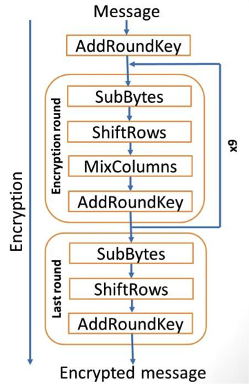

<h2>AES</h2>

Implementation of 128 bit AES Encryption & Decryption Algorithms in C++

https://en.wikipedia.org/wiki/Advanced_Encryption_Standard

<b>The Encryption Algo</b>

<b>Complete:</b>
Encryption - Check out.txt for step by step transformation. 
Look at AES.h and the implementation of encrypt() in .cpp

<b>TODO:</b>
Decryption

Author - bagarwa2